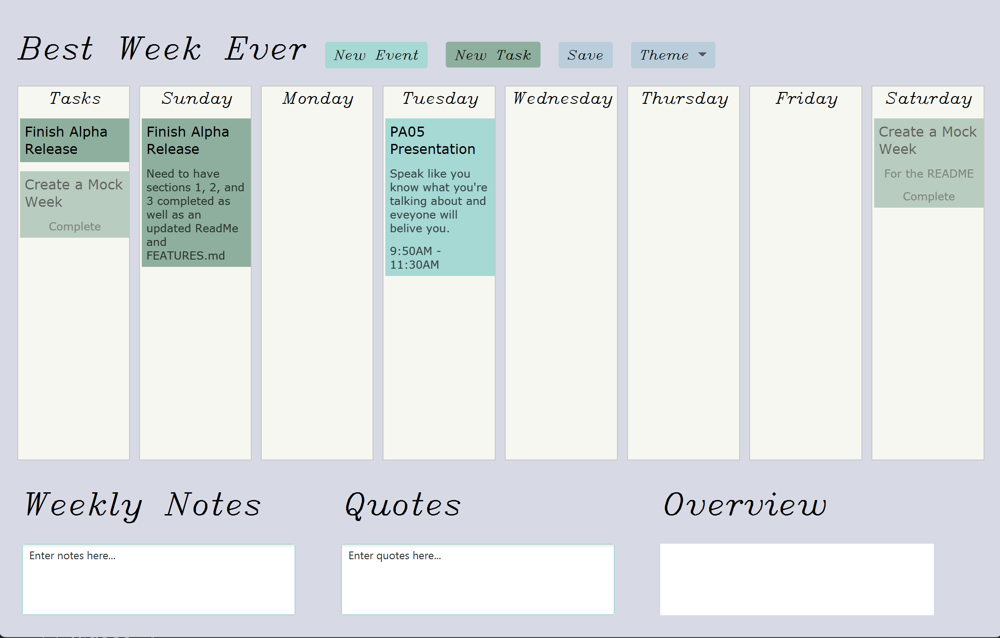

Streamline your weekly planning with our comprehensive toolkit. Enjoy a user-friendly week view, effortless event and
task creation, handy commitment warnings, reliable persistence, efficient task queue, customizable themes, inspirational
quotes, convenient note-taking, insightful weekly overviews, flexible adjustments, and delightful visual enhancements.
Experience the perfect blend of simplicity and functionality, empowering you to make the most of your week.

### Our project embraced the SOLID principles:

- Single Responsibility: Each Java class had a specific job, such as separating events and tasks into different classes.
- Open-Closed: Classes were open for extension but closed for modification. For example, the Activity class could be
  extended to easily implement Events and Tasks.
- Liskov Substitution: We seamlessly integrated different controllers into our GUI loader without complications.
- Interface Segregation: Abstract classes were used to facilitate code reuse among classes sharing similar
  functionality.
- Dependency Inversion: Our code remained flexible by allowing high-level components to provide reusable and unaffected
  complex logic.

These principles guided our development, ensuring clear responsibilities, extensibility, compatibility, code
reusability, and maintainability.

Our program is designed for easy expansion. We can effortlessly add new features, such as a progress bar, by integrating
them into the existing structure. Reusing our functionality makes it simple to incorporate additional buttons into the
Week Manager. This flexibility ensures that our program can adapt and grow to meet our evolving needs.